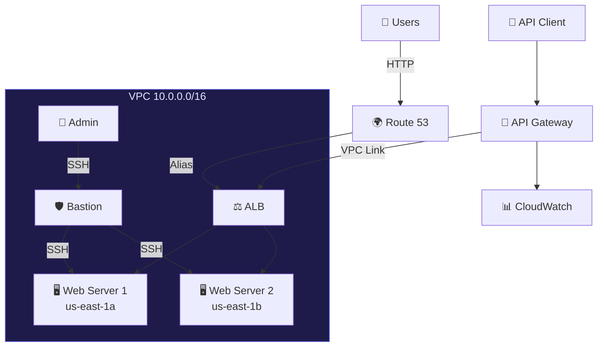

<div align="center">

# Webhosting On AWS

**Production-grade, multi-AZ web infrastructure on AWS — fully automated with Terraform**

[](https://www.terraform.io/)
[](https://aws.amazon.com/)
[](#-cost--free-tier)

</div>

---

## 📖 Overview

**MyApp** is a fully modular Terraform project that provisions a complete web application infrastructure on AWS. It deploys a highly available, multi-AZ architecture with load balancing, DNS management, API gateway integration, and hardened security — all optimized to run within the **AWS Free Tier**.

The infrastructure serves a real-time **status dashboard** via Nginx on EC2 instances, fronted by an Application Load Balancer and accessible through a custom domain via Route 53.

### Key Highlights

-  **Multi-AZ Deployment** — Web servers spread across `us-east-1a` and `us-east-1b` for high availability
-  **Application Load Balancer** — Layer 7 load balancing with health checks and HTTP/2
-  **API Gateway** — HTTP API with VPC Link, CORS, throttling, and CloudWatch logging
-  **Route 53 DNS** — Custom domain with apex + www alias records pointing to ALB
-  **Defense in Depth** — Layered security with Security Groups, NACLs, Bastion host, and IMDSv2
-  **Free Tier Optimized** — Carefully tuned to stay within AWS free tier limits
-  **Modular Design** — 6 independent Terraform modules with clean dependency management

---

## Architecture

> For the full architecture deep-dive with detailed diagrams, see **[architecture.md](architecture.md)**.



### Network Layout

| Tier | Subnet (AZ-a) | Subnet (AZ-b) | Purpose |
|------|---------------|---------------|---------|
| **Public** | `10.0.1.0/24` | `10.0.2.0/24` | ALB, Web Servers, Bastion |
| **Private** | `10.0.10.0/24` | `10.0.11.0/24` | Reserved for app tier expansion |
| **Database** | `10.0.20.0/24` | `10.0.21.0/24` | Reserved for RDS / database |

---

## Project Structure

```
my-app/
├── README.md                      # This file
├── architecture.md                # Detailed architecture diagrams
├── scripts/
│   └── user_data.sh               # Standalone reference of EC2 bootstrap
│
└── terraform/
    ├── main.tf                    # Root — wires all modules together
    ├── variables.tf               # Input variables with sensible defaults
    ├── outputs.tf                 # Stack outputs (IPs, DNS, SSH command)
    ├── provider.tf                # AWS provider config + default tags
    ├── versions.tf                # Terraform + provider version constraints
    │
    └── modules/
        ├── vpc/                   # VPC, 6 subnets, IGW, route tables
        ├── security/              # 3 Security Groups + private NACL
        ├── compute/               # 2 Web Servers + Bastion + Key Pair
        ├── load_balancer/         # ALB, Target Group, HTTP Listener
        ├── dns/                   # Route 53 A records (apex + www)
        └── api_gateway/           # HTTP API GW, VPC Link, CloudWatch
```

---

## Getting Started

### Prerequisites

| Tool | Version | Purpose |
|------|---------|---------|
| [Terraform](https://developer.hashicorp.com/terraform/downloads) | ≥ 1.0 | Infrastructure provisioning |
| [AWS CLI](https://aws.amazon.com/cli/) | v2 | AWS credential management |
| SSH Key Pair | — | EC2 access (`~/.ssh/id_rsa.pub`) |

### 1. Configure AWS Credentials

```bash
aws configure
# AWS Access Key ID: <your-key>
# AWS Secret Access Key: <your-secret>
# Default region: us-east-1
# Default output format: json
```

### 2. Clone & Initialize

```bash
git clone <your-repo-url>
cd my-app/terraform

terraform init
```

### 3. Review the Plan

```bash
terraform plan
```

### 4. Deploy

```bash
terraform apply
```

Type `yes` when prompted. Deployment typically takes **3–5 minutes**.

### 5. Access Your App

After successful deployment, Terraform will output:

```
Outputs:

alb_dns_name    = "myapp-alb-123456789.us-east-1.elb.amazonaws.com"
bastion_ip      = "54.xx.xx.xx"
webserver_ips   = ["3.xx.xx.xx", "18.xx.xx.xx"]
api_gateway_url = "https://abc123.execute-api.us-east-1.amazonaws.com/production"
ssh_command     = "ssh -i ~/.ssh/id_rsa ec2-user@54.xx.xx.xx"
nameservers     = ["ns-xxx.awsdns-xx.com", ...]
```

Open the **ALB DNS name** in your browser to see the dashboard.

### 6. Tear Down

```bash
terraform destroy
```

> ⚠️ **Always destroy** when not in use to avoid charges, especially the Route 53 hosted zone.

---

## Configuration

All variables have sensible defaults and can be overridden in `terraform.tfvars` or via CLI flags.

### Key Variables

| Variable | Default | Description |
|----------|---------|-------------|
| `aws_region` | `us-east-1` | AWS region for deployment |
| `project_name` | `myapp` | Prefix for all resource names and tags |
| `environment` | `production` | Environment label (production, staging, dev) |
| `vpc_cidr` | `10.0.0.0/16` | VPC CIDR block |
| `availability_zones` | `["us-east-1a", "us-east-1b"]` | AZs for multi-AZ deployment |
| `instance_type` | `t2.micro` | EC2 instance type (free tier eligible) |
| `domain_name` | `myapp.com` | Custom domain for Route 53 |
| `allowed_ssh_cidr` | `0.0.0.0/0` | CIDR allowed to SSH to bastion |
| `public_key_path` | `~/.ssh/id_rsa.pub` | Path to your SSH public key |

### Example: Custom Configuration

Create a `terraform.tfvars` file:

```hcl
project_name     = "my-portfolio"
environment      = "staging"
domain_name      = "example.com"
allowed_ssh_cidr = "203.0.113.42/32"   # Lock SSH to your IP
instance_type    = "t2.micro"
```

---

## Security

### Layered Security Model

```
Internet
    │
    ▼
┌─────────────────────────────┐
│  ALB Security Group         │  ← HTTP/HTTPS from 0.0.0.0/0
│  (Layer 1)                  │
└──────────────┬──────────────┘
               │
┌──────────────▼──────────────┐
│  Web Server Security Group  │  ← HTTP from ALB, SSH from Bastion only
│  (Layer 2)                  │
└──────────────┬──────────────┘
               │
┌──────────────▼──────────────┐
│  Network ACL (Stateless)    │  ← TCP 80/22 from VPC, ephemeral ports
│  (Layer 3)                  │
└─────────────────────────────┘
```

### Security Features

| Feature | Implementation |
|---------|---------------|
| **Bastion Host Pattern** | SSH access only through a dedicated bastion in the public subnet |
| **Security Groups** | 3 separate SGs: ALB, Web Server, Bastion — minimal permissions |
| **NACLs** | Stateless firewall on private subnets with explicit allow rules |
| **IMDSv2 Required** | Blocks SSRF-based metadata credential theft (hop limit = 1) |
| **Encrypted EBS** | All root volumes are encrypted at rest |
| **No NAT Gateway** | Private subnets fully isolated — no outbound internet |

### SSH Access

```bash
# Step 1: SSH into Bastion
ssh -i ~/.ssh/id_rsa ec2-user@<bastion-public-ip>

# Step 2: From Bastion, SSH into Web Servers
ssh ec2-user@<web-server-private-ip>
```

> 🔒 **Best Practice:** Change `allowed_ssh_cidr` from `0.0.0.0/0` to your specific IP address (`x.x.x.x/32`) for production use.

---

## Modules

Each module is self-contained with its own `main.tf`, `variables.tf`, and `outputs.tf`.

### Module Dependency Chain

```
vpc ──► security ──► compute ──► load_balancer ──► dns
  │          │                        │
  │          └────────────────────────┼──► api_gateway
  └───────────────────────────────────┘
```

| Module | Resources Created | Key Outputs |
|--------|-------------------|-------------|
| **vpc** | VPC, 6 Subnets, IGW, 3 Route Tables, 6 RT Associations | `vpc_id`, `public_subnet_ids`, `private_subnet_ids` |
| **security** | 3 Security Groups (ALB, Web, Bastion), 1 NACL | `alb_sg_id`, `webserver_sg_id`, `bastion_sg_id` |
| **compute** | 2 Web Server EC2s, 1 Bastion EC2, 1 Key Pair, AMI lookup | `webserver_instance_ids`, `bastion_public_ip` |
| **load_balancer** | ALB, Target Group, 2 TG Attachments, HTTP Listener, Listener Rule | `alb_dns_name`, `alb_zone_id`, `http_listener_arn` |
| **dns** | 2 Route 53 A Records (apex + www) | — |
| **api_gateway** | HTTP API, VPC Link, Integration, Route, Stage, CloudWatch Log Group | `invoke_url` |

---

## Cost & Free Tier

This architecture is optimized for the **AWS Free Tier**.

| Service | Free Tier Allowance | This Project | Status |
|---------|--------------------:|:-------------|:------:|
| **EC2** (t2.micro) | 750 hrs/month | 3 instances (shared pool) | ⚠️ |
| **EBS** (gp2) | 30 GB | 28 GB (10+10+8) | ✅ |
| **ALB** | 750 hrs + 15 LCUs/mo | 1 ALB | ✅ |
| **API Gateway** (HTTP) | 1M calls/month | 1 API | ✅ |
| **Route 53** | — | 1 Hosted Zone | ₹ 47/mo |
| **CloudWatch Logs** | 5 GB ingest | API GW logs | ✅ |
| **Data Transfer** | 1 GB out/month | Minimal | ✅ |

> ⚠️ **EC2 Warning:** 3 instances × 730 hrs = 2,190 hrs/month, exceeding the 750 hr free tier limit. Consider stopping unused instances or running only 1 web server during development.

> 💡 **Tip:** Run `terraform destroy` when not actively using the infrastructure to avoid any charges.

---

## 🔮 Roadmap

Planned enhancements for production readiness:

- [ ] **HTTPS/TLS** — ACM certificate + HTTPS listener with HTTP→HTTPS redirect
- [ ] **NAT Gateway** — Enable outbound internet for private subnets
- [ ] **Auto Scaling Group** — Replace static EC2s with dynamic scaling
- [ ] **RDS Database** — Deploy managed database in DB subnets
- [ ] **AWS WAF** — Web application firewall on ALB
- [ ] **CI/CD Pipeline** — GitHub Actions or CodePipeline for automated deployments
- [ ] **Monitoring** — CloudWatch alarms + SNS notifications
- [ ] **S3 Remote State** — Migrate state to S3 with DynamoDB locking

---

## 📚 Related Documentation

- [architecture.md](architecture.md) — Full architecture diagrams (network, security, traffic flow, module dependencies)
- [scripts/user_data.sh](scripts/user_data.sh) — Standalone reference of the EC2 bootstrap script

---

## 🛠️ Common Operations

### View Current State

```bash
terraform show
```

### Update a Single Module

```bash
terraform apply -target=module.compute
```

### Refresh Outputs

```bash
terraform output
```

### Format All .tf Files

```bash
terraform fmt -recursive
```

### Validate Configuration

```bash
terraform validate
```

---

## ⚠️ Important Notes

1. **SSH Key Required** — You must have an SSH key pair at `~/.ssh/id_rsa.pub` before running `terraform apply`. Generate one with:
   ```bash
   ssh-keygen -t rsa -b 4096
   ```

2. **Domain Ownership** — The Route 53 hosted zone creates NS records. For a real domain, update your registrar's nameservers to match the `nameservers` output.

3. **State File Security** — The `terraform.tfstate` file contains sensitive data. For team use, configure [remote state](https://developer.hashicorp.com/terraform/language/state/remote) with S3 + DynamoDB.

4. **Destroy After Demo** — Route 53 hosted zones cost ₹47/month. Always run `terraform destroy` when finished.

---
