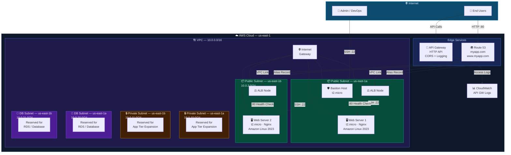
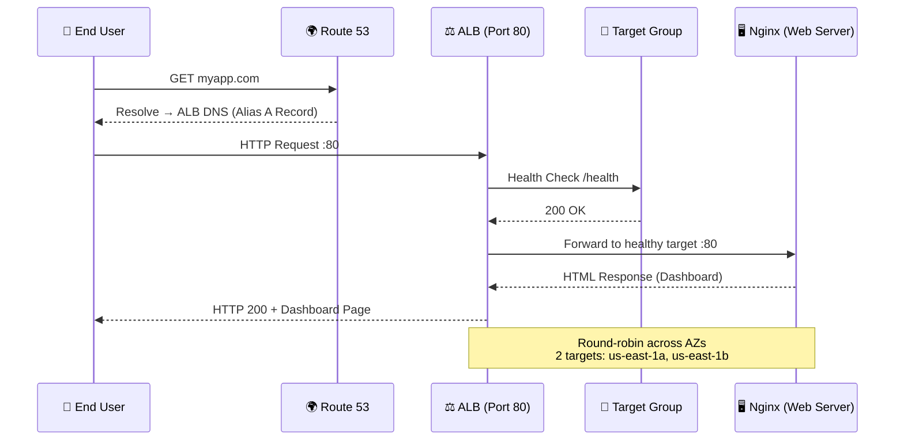
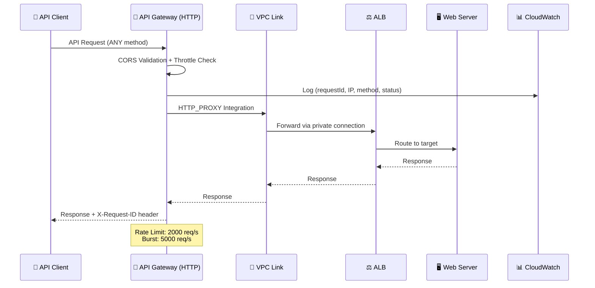
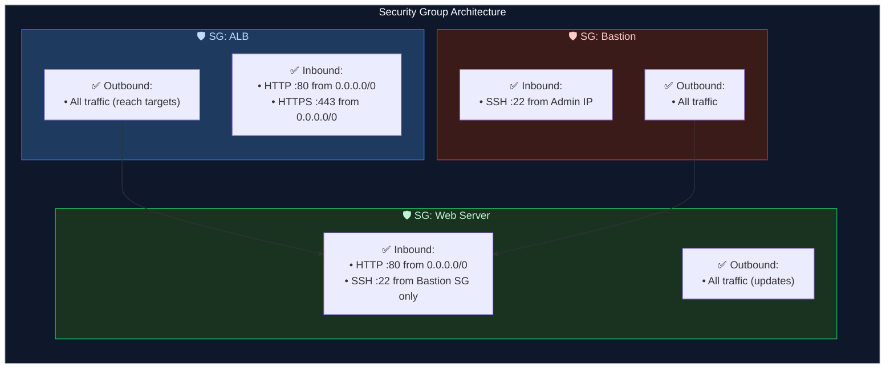
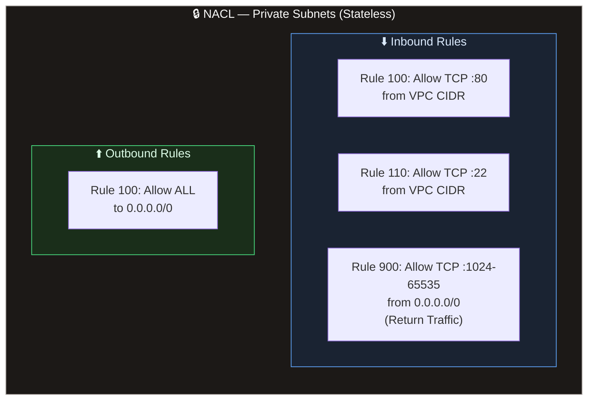
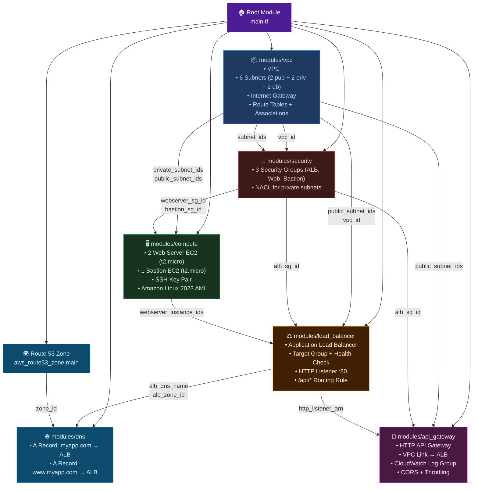
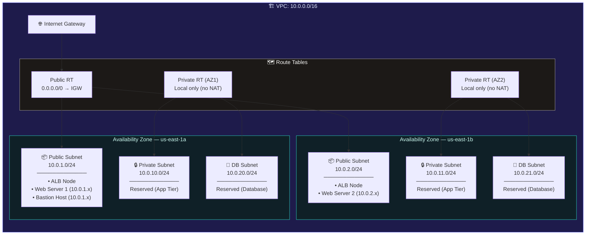
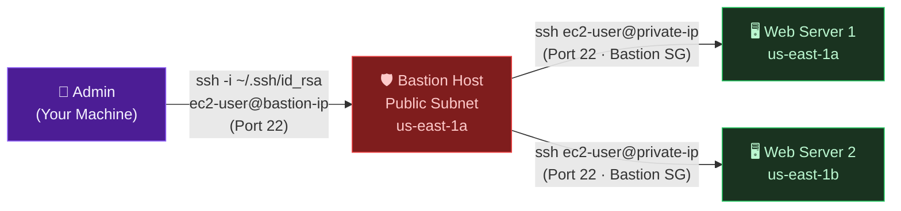
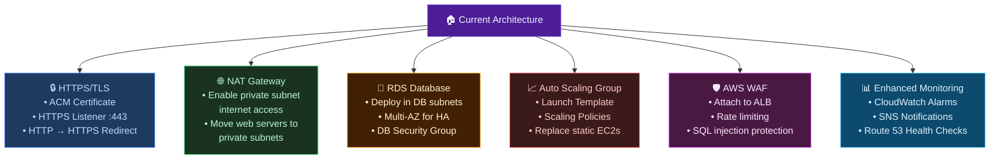

# ☁️ MyApp — AWS Cloud Architecture

> **Project:** `myapp` &nbsp;|&nbsp; **Region:** `us-east-1` &nbsp;|&nbsp; **Environment:** `production`
> **IaC:** Terraform &nbsp;|&nbsp; **Tier:** AWS Free Tier Optimized

---

## 📐 High-Level Architecture Overview



---

## 🔄 Request Traffic Flow



### API Gateway Flow



---

## 🔐 Security Architecture



### Network ACL — Private Subnets



---

## 🧩 Terraform Module Dependency Graph



---

## 🏗️ Network Topology Detail



---

## 📋 Resource Inventory

### Compute Resources

| Resource | Type | Spec | Subnet | AZ | Free Tier |
|----------|------|------|--------|-----|-----------|
| Web Server 1 | `aws_instance` | t2.micro · 10 GB gp2 · Encrypted | Public (10.0.1.0/24) | us-east-1a | ✅ 750 hrs/mo |
| Web Server 2 | `aws_instance` | t2.micro · 10 GB gp2 · Encrypted | Public (10.0.2.0/24) | us-east-1b | ✅ 750 hrs/mo |
| Bastion Host | `aws_instance` | t2.micro · 8 GB gp2 · Encrypted | Public (10.0.1.0/24) | us-east-1a | ✅ 750 hrs/mo |

### Networking Resources

| Resource | Type | Details |
|----------|------|---------|
| VPC | `aws_vpc` | CIDR: 10.0.0.0/16 · DNS Hostnames: Enabled |
| Internet Gateway | `aws_internet_gateway` | Attached to VPC |
| Public Subnets (×2) | `aws_subnet` | 10.0.1.0/24, 10.0.2.0/24 · Auto-assign Public IP |
| Private Subnets (×2) | `aws_subnet` | 10.0.10.0/24, 10.0.11.0/24 · No internet |
| DB Subnets (×2) | `aws_subnet` | 10.0.20.0/24, 10.0.21.0/24 · Isolated |
| ALB | `aws_lb` | Internet-facing · HTTP/2 · 2 AZs |
| Target Group | `aws_lb_target_group` | Health check: /health · Interval: 30s |
| API Gateway | `aws_apigatewayv2_api` | HTTP API · VPC Link to ALB |

### DNS Resources

| Resource | Type | Target |
|----------|------|--------|
| Route 53 Zone | `aws_route53_zone` | myapp.com |
| A Record (apex) | `aws_route53_record` | myapp.com → ALB (Alias) |
| A Record (www) | `aws_route53_record` | www.myapp.com → ALB (Alias) |

### Security Resources

| Resource | Inbound | Outbound |
|----------|---------|----------|
| ALB SG | HTTP :80, HTTPS :443 from 0.0.0.0/0 | All |
| Web Server SG | HTTP :80 from 0.0.0.0/0, SSH :22 from Bastion SG | All |
| Bastion SG | SSH :22 from Admin IP | All |
| Private NACL | TCP :80/:22 from VPC, Ephemeral from 0.0.0.0/0 | All |

---

## 🔑 SSH Access Path



---

## 💰 Free Tier Cost Summary

| Service | Free Tier Allowance | Usage in Architecture | Status |
|---------|--------------------|-----------------------|--------|
| EC2 (t2.micro) | 750 hrs/month × 12 mo | 3 instances (shared 750 hrs) | ⚠️ Monitor hours |
| EBS (gp2) | 30 GB/month | 28 GB (10+10+8) | ✅ Under limit |
| ALB | 750 hrs + 15 LCUs/mo × 12 mo | 1 ALB | ✅ Within limits |
| Route 53 | — | 1 Hosted Zone ($0.50/mo) | 💲 Paid |
| API Gateway (HTTP) | 1M calls/month × 12 mo | 1 HTTP API | ✅ Within limits |
| CloudWatch Logs | 5 GB ingest + 5 GB storage | API GW logs (30-day retention) | ✅ Within limits |
| Data Transfer | 1 GB out/month | Minimal | ✅ Within limits |

> [!WARNING]
> **Route 53 Hosted Zone** costs **$0.50/month** regardless of usage. Destroy after demo to stop billing.

> [!NOTE]
> **NAT Gateway** has been intentionally removed to stay within free tier. Private/DB subnets have **no internet access**. Web servers are deployed in **public subnets** as a cost-saving measure.

---

## 📂 Terraform Module Structure

```
my-app/
├── scripts/
│   └── user_data.sh              # Standalone reference of bootstrap script
├── terraform/
│   ├── main.tf                   # Root — wires all modules together
│   ├── variables.tf              # Input variables with defaults
│   ├── outputs.tf                # Stack outputs (IPs, DNS, SSH cmd)
│   ├── provider.tf               # AWS provider + default tags
│   ├── versions.tf               # Terraform + provider version locks
│   └── modules/
│       ├── vpc/                  # VPC, 6 subnets, IGW, route tables
│       │   ├── main.tf
│       │   ├── variables.tf
│       │   └── outputs.tf
│       ├── security/             # 3 Security Groups + NACL
│       │   ├── main.tf
│       │   ├── variables.tf
│       │   └── outputs.tf
│       ├── compute/              # 2 Web Servers + Bastion + Key Pair
│       │   ├── main.tf
│       │   ├── variables.tf
│       │   └── outputs.tf
│       ├── load_balancer/        # ALB + Target Group + Listener
│       │   ├── main.tf
│       │   ├── variables.tf
│       │   └── outputs.tf
│       ├── dns/                  # Route 53 A Records (apex + www)
│       │   ├── main.tf
│       │   └── variables.tf
│       └── api_gateway/          # HTTP API GW + VPC Link + CloudWatch
│           ├── main.tf
│           ├── variables.tf
│           └── outputs.tf
└── terraform.tfstate
```

---

## 🔮 Future Expansion Paths



---

<div align="center">

*Architecture managed by **Terraform** · Diagrams auto-generated from IaC analysis*

</div>
